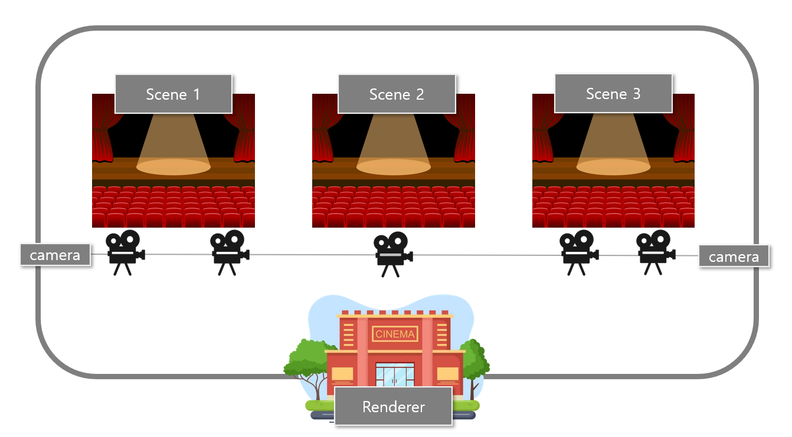
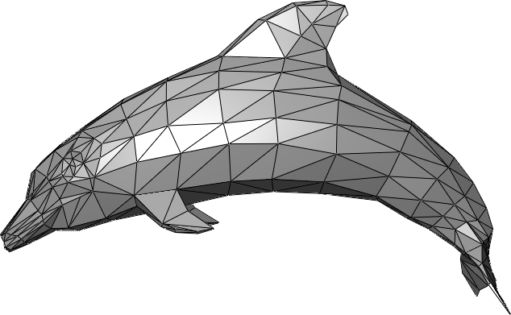
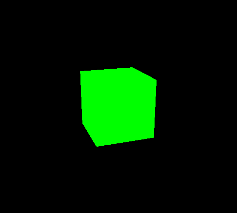
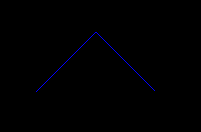
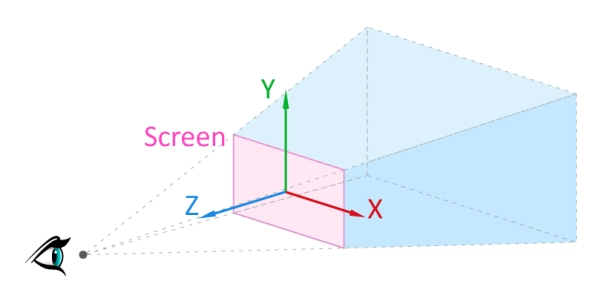
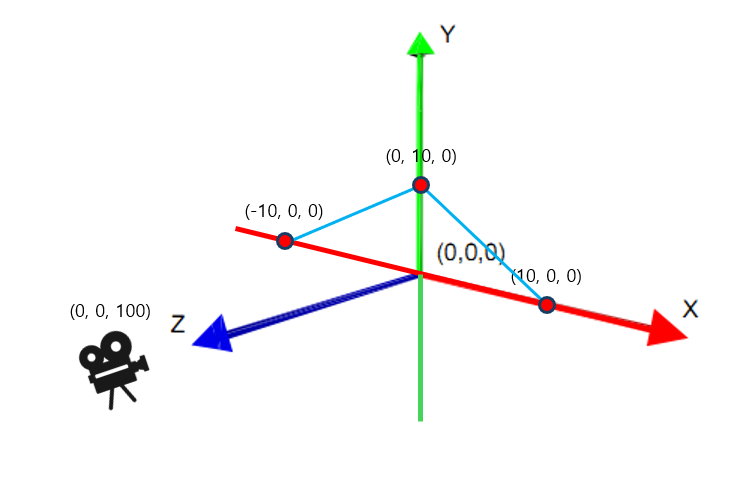

# Three.js 정리

> 김승섭 (sub9707)에 의해 작성

## 목차

1. [기본 환경 설치](#설치)
2. [THREE.js 기본 요소](#threejs-기본-구성요소)
3. [기본 요소 구현](#기본-요소-구현)
4. [WebGL 지원 확인](#)
5. [예제1 - 정육면체 생성](#예제1---정육면체-생성)
6. [예제2 - 선그리기](#예제2---점을-이용해-선-그리기)
7. [3D 텍스트를 출력하는 방법](#텍스트-출력)

[외부] <a href="./ThreeJS_on_ReactJS.md">ReactJS에서 ThreeJS 구현하기 </a><br/>
[외부] <a href="./ThreeJS_Fiber.md">threeJS 라이브러리 Three/fiber </a><br/>
[외부] <a href="./ThreeJS_Drei.md">threeJS 라이브러리 Three/Drei </a><br/>

## 설치

```bash
# three.js
npm install --save three

# vite
npm install --save-dev vite
```

### 설치항목 설명

### three.js

Three.js는 웹에서 3D 그래픽을 만들기 위한 JavaScript 라이브러리이다.<br/>
내부적으로 `WebGL`을 기반으로 하며, WebGL은 웹 브라우저에서 하드웨어 가속 3D 그래픽을 그리기 위한 표준이다.<br/>
Three.js를 사용하면 3D 모델을 만들고 렌더링하며, 빛과 재질을 조작하여 현실적인 3D 경험을 웹에 구현할 수 있다.<br/>
또한 Three.js는 웹 기반이기 때문에, 브라우저와 DOM API에 의존한다. 따라서 NodeJS 환경에서는 항상 존재할 수 없다.

<U>해당 문서는 아래 공식 DOCS를 보고 작성되었습니다.<br/></U>
<a href="https://threejs.org/docs/" target="_blank">THREE.js DOCS</a>

```
WebGL: OpenGL ES 2.0기반의 3차원 그래픽스 API를 위한 크로스 플랫폼 웹 표준으로,
웹 브라우저에서 별도의 플러그인을 설치하지 않고도 3차원 그래픽을 표현할 수 있도록 해준다.
```

<br/>
<br/>

# Three.js 기본 구성요소

ThreeJS에는 가장 중요한 세가지 개념이 존재한다.

### Scene (장면)

Three.js의 모든 요소가 배치되는 공간.<br/>
`Scene`에는 개체, 조명, 카메라를 배치할 수 있다.<br/>
Three.js는 객체 지향 패러다임의 기반이므로, Scene은 생성자를 통해 `Scene 객체`를 생성한다.<br/>
하나 이상의 Scene을 통해 우리는 앱에서 여러 Scene 인스턴스를 생성하고 웹에서 구현할 수 있다.<br/>
Scene이 없다면 어떠한 개체도 표현할 수 없다.

### Camera (카메라)

화면상으로 보이는 장면의 시점을 결정한다.<br/>
Three.js에는 여러 종류의 카메라가 있으며, 대표적으로 `PerspectiveCamera`(원근 카메라)와 `OrthographicCamera`(직교 카메라)가 있다.
어떠한 카메라도 없다면, 아무 것도 볼 수 없다.

### Renderer (렌더러)

Scene과 Camera를 구성했다면, 앱에 추가해야하는데 다른 웹 컴포넌트와 같이 Scene을 DOM에 추가해야한다.<br/>
이 때 렌더러가 제 역할을 한다.<br/>
`WebGLRenderer`이라는 생성자를 통해 `Scene`과 `Camera`를 DOM에 추가한다.<br/>
<br/><br/>
부족한 그림 솜씨로 위 요소를 비유하여 표현하자면 아래와 같다.



> 극장 내부에서 직접 볼 수 없는 Renderer라는 극장은 Scene이라는 연극들을 상영한다. <br/>이 연극은 외부의 화면으로만 관람이 가능하다.<br/> 각 상영관(Scene)들은 다수의 카메라와 배우들(개체), 조명 등으로 구성된다. <br/>지정된 Camera에 따라 외부의 관람객들은 연극을 관람할 수 있다.

<U>**_이 3가지 요소가 threeJS가 동작하는 필수 요소와 같다._**</U>
<br/><br/>

# 기본 요소 구현

### Scene 생성

threejs에서 무언가를 보여주기 위해서는 `Scene, Camera, Renderer` 세 요소가 필요하다.<br/>
아래의 선언 코드를 살펴보자.

```js
import * as THREE from "three";

const scene = new THREE.Scene();
const camera = new THREE.PerspectiveCamera(
  75,
  window.innerWidth / window.innerHeight,
  0.1,
  1000
);

const renderer = new THREE.WebGLRenderer();

renderer.setSize(window.innerWidth, window.innerHeight);
document.body.appendChild(renderer.domElement);
```

### Camera 선언

생성자를 통해 Scene을 생성한 후, Camera를 선언했다.<br/>
여러 카메라가 있지만 우선 PerspectiveCamera를 사용하도록 한다.<br/>

```js
const camera = new THREE.PerspectiveCamera(
  75, // FOV (Field of View)
  window.innerWidth / window.innerHeight, // Aspect Ratio
  0.1, // near
  1000 // far
);
```

속성 중 첫번째 인자는 `FOV(Field of View)` 값이다.<br/>
FOV는 카메라의 시야각으로, 값이 클수록 넓은 영역이 보이고 작을수록 시야가 좁아지며 더 많은 객체를 볼 수 있다.<br/><br/>
두번째 인자는 `종횡비(Aspect Ratio)`이다. 화면의 가로 세로 비율을 나타낸다.<br/>
나머지 두 속성은 `near`와 `far` 속성이다.<br/>
near와 far값은 카메라로부터 떨어진 물체가 far보다 멀리 혹은, near보다 가까이 존재한다면 렌더링되지 않게 된다.<br/>

### Renderer 선언

```js
const renderer = new THREE.WebGLRenderer();

renderer.setSize(window.innerWidth, window.innerHeight);
document.body.appendChild(renderer.domElement);
```

`Renderer`는 인스턴스 생성에 이어 사이즈를 설정해 주어야 한다.<br/>
보통 우리가 사용하는 앱의 크기에 맞추기 위해, `browser window`의 너비와 높이를 채워 설정한다.<br/>
화면 크기는 유지한채로 화질만 낮추려면, `setSize`의 세번째 인자로 false를 전달하면 절반의 해상도로 출력된다.
<br/><br/>

# WebGL 지원 확인

몇몇 기기나 브라우저는 WebGL을 지원하지 않는 환경도 있다.<br/>
아래 메서드를 활용해 WebGL 지원을 감지하고 유저에게 메시지를 전달할 수 있다.

```js
import WebGL from "three/addons/capabilities/WebGL.js";

if (WebGL.isWebGLAvailable()) {
  // webgl이 지원 가능하다면 해당 블록에서 함수나 변수 초기화 셋팅
  // React에서는 컴포넌트 render 이전에 return 시키면 된다.
  animate();
} else {
  // 경고 문구를 추가함.
  const warning = WebGL.getWebGLErrorMessage();
  document.getElementById("container").appendChild(warning);
}
```

<br/>

# 예제1 - 정육면체 생성

우선 통 코드부터 살펴보자.<br/>
아래 코드는 ThreeJS를 활용해 회전하는 정육면체 하나를 렌더링하기 위한 최소 코드이다.

```js
import * as THREE from "three";

const scene = new THREE.Scene();
const camera = new THREE.PerspectiveCamera(
  75,
  window.innerWidth / window.innerHeight,
  0.1,
  1000
);

const renderer = new THREE.WebGLRenderer();
renderer.setSize(window.innerWidth, window.innerHeight);
document.body.appendChild(renderer.domElement);

const geometry = new THREE.BoxGeometry(1, 1, 1);
const material = new THREE.MeshBasicMaterial({ color: 0x00ff00 });
const cube = new THREE.Mesh(geometry, material);
scene.add(cube);

camera.position.z = 5;

function animate() {
  requestAnimationFrame(animate);

  cube.rotation.x += 0.01;
  cube.rotation.y += 0.01;

  renderer.render(scene, camera);
}

animate();
```

앞서 배운대로, Scene, Camera, Renderer를 선언했다.<br/>

```js
const geometry = new THREE.BoxGeometry(1, 1, 1);
```

Three에서 제공하는 `BoxGeometry` 생성자를 통해 x,y,z 축 각 크기 1인 기본 정육면체 개체를 생성할 수 있다.<br/>
이 정육면체에 이미지 파일이나 색상을 입힐 수 있다.<br/>

```js
const material = new THREE.MeshBasicMaterial({ color: 0x00ff00 });
```

게임 캐릭터의 스킨과 같이 옷의 역할을 `Material`이라는 속성이 맡게된다.<br/>

```js
const cube = new THREE.Mesh(geometry, material);
```

그 다음로 알아야할 요소가 `Mesh`인데, mesh는 우리말로 그물과 같은 망을 의미한다.<br/>
망처럼 다각형들을 잇고 이어 집합을 이루는데 이 집합이 객체의 외관을 그리게된다.<br/>
mesh 속성은 기하와 여기에 적용되는 material을 지니는 객체가 되며, Scene에 넣어서 움직일 수 있도록 한다.<br/><br/>

<p align="center">
  
</p>

> 점과 점이 이어져 면과 다각형(Polygon)을 이루고, 이 다각형이 이어져 망(Mesh)을 이룬다. <br/>
> 그림 출처 - 위키백과 (Polygon, Mesh)

<br/>
이제 이 완성된 개체를 Scene에 추가해준 뒤 카메라의 위치를 수정해주었다.
<br/><br/>

```js
function animate() {
  requestAnimationFrame(animate);

  cube.rotation.x += 0.01;
  cube.rotation.y += 0.01;

  renderer.render(scene, camera);
}

animate();
```

위 함수는 `requestAnimationFrame` 메서드를 활용해 애니메이션을 구현하는 함수이다.<br/>
<a href="https://developer.mozilla.org/ko/docs/Web/API/window/requestAnimationFrame" target="_blank">requestAnimationFrame</a>는 웹 브라우저에서 제공하는 API 중 하나로,브라우저에게 다음 프레임을 렌더링하기 전에 지정된 함수를 호출하도록 요청한다.<br/> 우리는 이 API를 통해 각 프레임마다 렌더링을 진행해 애니메이션을 구현할 수 있다.<br/>

위 코드를 통해 정육면체 개체가 프레임마다 x축과 y축 기준 0.01만큼 움직이는 애니메이션을 구현할 수 있다.

vite를 설치했으니 vite를 통해 dev 서버를 열고 빠르게 확인해보자.

```
npx vite
```

<p align="center">
  
</p>
<br/>

# 예제2 - 점을 이용해 선 그리기

점을 이으면 선이 되고, 그 선들을 이으면 다각형이 된다.<br/>
그 다각형들이 모여 Mesh를 이루어 와이어프레임이 형성되는데,<br/>
이번에는 다각형의 부분인 선들을 그려보자.<br/>

우선 가장 기초적인 Scene, Camera, Renderer의 초기화 및 설정은 위의 내용과 동일하기에 생략한다.<br/>

위의 정육면체와 같이, 도형(Geometry)과 재질(Material)이 필요하다.

```js
const material = new THREE.LineBasicMaterial({ color: 0x0000ff });
```

THREE.js에서 제공되는 `LineBasicMaterial`을 통해 선분 Material을 생성한다.<br/>
<br/>
이후 도형(Geometry)을 선으로 생성하기 위해서는 점(Point)들이 필요한데, 이 점들을 THREE 메서드를 통해 선으로 이을 수 있다.

```js
const points = [];
points.push(new THREE.Vector3(-10, 0, 0));
points.push(new THREE.Vector3(0, 10, 0));
points.push(new THREE.Vector3(10, 0, 0));

const geometry = new THREE.BufferGeometry().setFromPoints(points);
```

각 점들을 잇는 방식은 배열의 연속된 순서에 따라 선분이 연결되며, 떨어진 요소에 대해서는 연결되지 않는다는 특징을 가진다.

```js
const line = new THREE.Line(geometry, material);

scene.add(line);
renderer.render(scene, camera);
```

생성자로 도형과 재질을 인자로 전달하면 선분을 생성할 수 있다.

```js
camera.position.set(0, 0, 100);
```

현재 카메라 위치에서는 선분이 보이지 않기 때문에 카메라 위치도 조절해준다.

<p align="center">
  
</p>

### XYZ 축?

<p align="center">
  
</p>

> 그림 출처 - <a href="https://eztutorblog.wordpress.com/2016/10/26/three-js-9-skycube/" target="_blank">THREE.JS NOTES FOR BEGINNER</a><br/>

참고로, 카메라와 개체를 이동시킬 때 `xyz축(axis)`의 이해가 필요하다.<br/>
수학적인 좌표 개념과 다르게, threeJS과 같은 그래픽 툴의 축 개념은 다르다.<br/>
수평 수직을 x축과 y축이 값을 가지고, 화면쪽 거리 크기(화면의 깊이)를 z축이 가진다.<br/>
CSS의 속성인 `Z-index`를 떠올려보자.<br/>
화면을 기준으로 개체들의 높낮이 순위가 결정된다.<br/>
보는 시점, 카메라 위치에 따라 우리에게 보이는 축이 달라지지만, 개체의 상대적 위치와 방향을 정확히 파악하기 위해서는 XYZ축을 이해하는 것이 중요하다.

<p align="center">
  
</p>

> 만약 카메라 위치 설정을 하지 않는다면 선과 같은 z축에 위치해 도형이 보이지 않게된다.

<br/>

# 텍스트 출력

3D 환경에서 텍스트를 출력해야할 때, 텍스트를 띄우는 방법에 대해 Three.JS 공식 문서는 아래 7가지 방식을 제안한다.

## 1. DOM + CSS

다른 HTML과 같이 텍스트를 포함한 요소를 추가하는 방식이다.<br/>
가장 쉽고 빠른 방식이며 CSS를 통해 z-index의 위치나 스타일을 지정할 수 있다.<br/>

```js
<div id="texts">Text Example</div>

#texts {
	position: absolute;
	width: 100%;
	z-index: 100;
}
```

## 2. CSS2DRenderer, CSS3DRenderer 사용

이 렌더러를 사용하면 three.js Scene에 고품질의 텍스트를 DOM 요소에 추가할 수 있다.<br/>
1번과 비슷하지만, Scene에 더 동적이고 탄탄하게 통합될 수 있다는 장점을 가진다.<br/>
`CSS3DRenderer`는 CSS3의 `transfrom` 속성을 활용해 DOM요소에 3D 효과를 내는데 사용하는 렌더러다. <br/>캔버스 요소 없이 3D효과를 낼 때 사용하는데, three.js의 material이라던가, geometry를 활용하지 못한다는 한계점이 있다.

## 3. 3D 툴로 3D 모델로 만든 후 three.js에 로드

여러 그래픽 툴로 3d object를 생성한 후 모델로써 활용하는 방식이다.<br/>
여러 텍스트가 필요하거나 동적으로 변하는 텍스트의 경우 불편한 방식일 듯 하다.<br/>

## 4. Procedure Text Geometry

순수 three.js를 활용해 동적인 3D 텍스트 도형을 생성할 수 있다.

```js
import { TextGeometry } from "three/addons/geometries/TextGeometry.js";
new THREE.TextGeometry(text, parameters);

loader.load("fonts/helvetiker_regular.typeface.json", function (font) {
  const geometry = new TextGeometry("Hello three.js!", {
    font: font, // font 셋팅
    size: 80,
    height: 5,
    curveSegments: 12, //extrudeSettings
    bevelEnabled: true,
    bevelThickness: 10,
    bevelSize: 8,
    bevelOffset: 0,
    bevelSegments: 5,
  });
});
```

`TextGeometry`는 단일 텍스트 형체 생성 클래스로, 텍스트 문자열과 폰트 설정, `ExtrudeGeometry` 설정(텍스쳐, 형태 등 외관 매핑)을 파라미터로 전달해 생성한다.
<br/><br/>
이외에도 비트맵 폰트, 캔버스, 외부 패키지를 활용한 방식도 있으니 <a href="https://threejs.org/docs/#manual/en/introduction/Creating-text" target="_blank">DOCS</a>를 참고하자.
<br/><br/>

# 3D 모델파일 로드하기

3D 모델 파일은 각자의 목적에 따라 다양한 포맷으로 존재한다.<br/>
그 가운데 ThreeJS는 많은 모델 파일을 로드하기 위한 로더들을 제공하며 우리는 이 중 적절한 포맷과 워크플로우에 맞는 로더를 선택할 수 있다. <br/>
포맷 중 `glTF`와 `GLB` 포맷이 가장 잘 지원된다.<br/>
glTF는 런타임 에셋 전달에 초점을 두기에 전송이 간편하고 로드 속도가 빠르다.<br/>
포맷에는 다음과 같은 속성들을 포함한다.<br/>
`meshes, materials, textures, skins, skeletons, morph targets, animations, lights, cameras`

## 로드

```js
import { GLTFLoader } from "three/addons/loaders/GLTFLoader.js";
```

GLTFLoader를 포함한 소수의 로더는 threeJS에서 기본적으로 제공된다.<br/>
이외의 로더는 따로 라이브러리에서 추가를 해야한다.

```js
const loader = new GLTFLoader();
loader.load(
  "path/to/model.glb",
  function (gltf) {
    scene.add(gltf.scene);
  },
  undefined, // 로딩 중 호출되는 xhr 함수
  function (error) {
    console.error(error);
  }
);
```

loader의 첫번째 인자로는 `resource URL`로 리소스의 위치를 명시한다.<br/>
두번째 인자는 `리소스가 로드되면 호출될 함수`를 전달한다.<br/>
여기서는 `모델 파일이 로드됐을때` Scene에 모델을 추가한다.<br/>
세번째는 `loading 중 진행`할 함수로, 주로 로드 진행률을 표시할 때 사용한다.<br/>
마지막으로는 `load 중 발생한 에러`를 핸들링하기 위한 함수를 전달한다.<br/>
