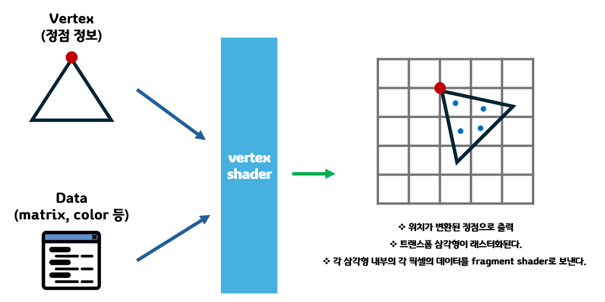
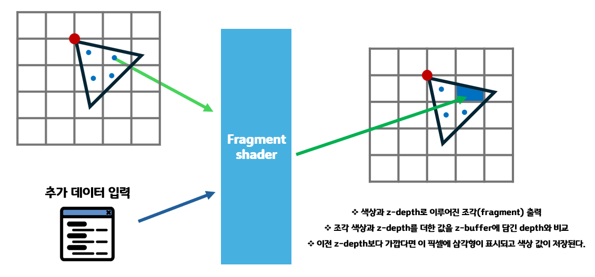

# Threejs Shader
Shader는 WebGL 주요 요소중 하나로, Threejs 라이브러리를 사용하지 않고 WebGL을 통해 3D 환경을 구현한다면 배워야했을 어려운 것 중 하나이다.<br/>


쉐이더는 ```GLSL(OpenGL Shading Language)```라는 언어로 작성된 프로그램으로 GPU로 전송된다.<br/>
Three.js를 사용하는 경우, GLSL 코드를 직접 작성하는 대신 Three.js의 재질(Material)에 대한 설정을 통해 Shader를 구성한다.<br/>
Geometry의 각 꼭짓점을 배치하고, 해당 Geometry의 보이는 fragments(픽셀 개념)을 색상화하는 데 사용된다.<br/>
이 후, vertices의 좌표, mesh 변환, 카메라와 시야 정보, 색상, 텍스쳐, 조명, 안개 등 매개 변수 데이터를 Shader에 보낸다.<br/> GPU는 Shader를 따라 이 모든 데이터를 처리하고 Geometry들이 렌더링된다.
<p align="center">
  
  <a href="https://open.gl/drawing">OpenGL - The graphics pipeline</a>
</p>

쉐이더에는 두가지 종류가 있다.<br/><br/>

## Vertex Shader
Vertex Shader는 주로 물체의 ```정점 정보```에 수학적인 연산을 함으로써 물체에 특별한 효과를 주고, 화면 상에 변환하는 작업을 수행한다.<br/>

<p align="center">
  
</p>

> [개념 참고 - Udacity - Certex and Fragment Shader](https://www.youtube.com/watch?app=desktop&v=C1ZUeHLb0YU)


threejs의 geometry가 제공하는 모든 정점에 대해 한 번씩 실행된다.

```C
void main(){
    gl_Position = projectionMatrix * modelViewMatrix * vec4(position, 1);
}
```
기본적으로, ```gl_Position```의 속성을 설정하며 이는 화면에서의 정점 위치를 나타내는 x, y, z 좌표이다.
Vertex Shader를 사용하게 되면 이 위치를 수학적으로 조작하여 형상의 모양을 변화시킬 수 있다.<br/><br/>

## Fragment Shader
모든 정점들을 실행하는 Vertex Shader와 다르게, Fragment Shader는 말그대로 Geometry의 모든 Fragment(Pixel)들에 대해 한 번 실행한다.<br/>
아래 그림과 같이 Vertex Shader의 결과를 기반으로 각 픽셀의 최종 색상을 결정한다.<br/>
작동하는 방식은 Vertex Shader와 유사하다.<br/>

<p align="center">
  
</p>


```C
void main(){
    // 한 픽셀에 대해 색상을 결정
    gl_FragColor = vec4(1.0, 0.0, 0.0, 1.0);
}
```
rgba 형식으로 반복되는 해당 픽셀의 색상을 설정하게 된다.
<br/><br/>

## Unified Shader

<p align="center">
  
</p>

모던 GPU는 GPU 하드웨어 자체에서 ```통합 Shader```를 지원한다.<br/>
이 Shader 프로세서는 병목 현상이 발견된 위치에 따라 vertex shader와 fragment shader를 실행하기 위해 GPU에 바로 할당된다.<br/>
프로그램의 구조를 단순화하고, 효율적인 리소스 사용을 가능케한다.<br/>
Vertex와 Fragment 처리 사이에서 데이터와 리소스 공유를 가능케해 메모리 사용량을 줄여 성능을 향상시킨다.