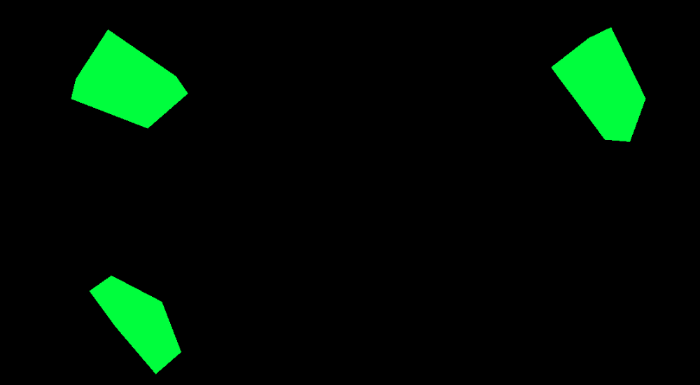
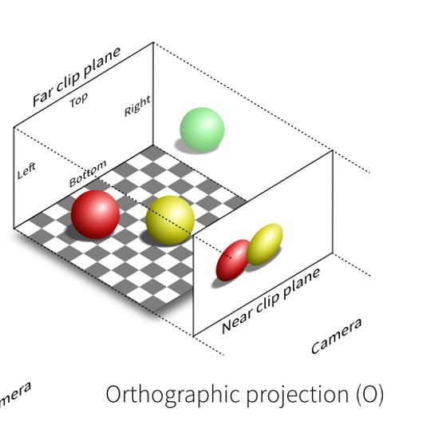
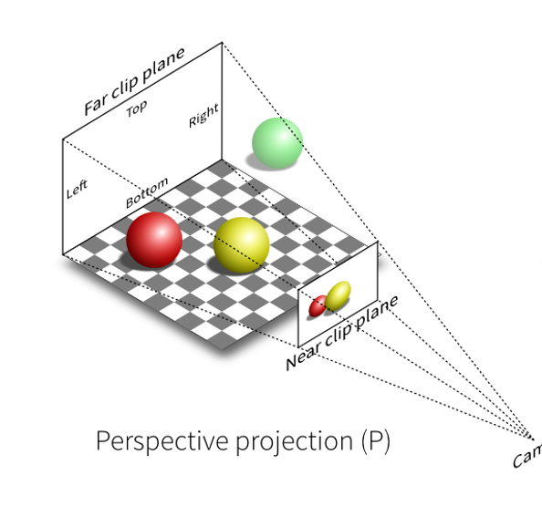

# Cameras

## Camera

카메라의 추상 기본 클래스이다.<br/>
새로운 카메라를 생성할 때 상속해야한다.<br/>

```js
Camera();
```

<strong><U>절대 바로 호출되는 용도가 아니기에</U></strong>, 파생 클래스인 PerspectiveCamera나 OrthographicCamera를 호출해야한다.<br/>
따라서 메서드나 속성은 아래 링크에서 확인하자.<br/>
[Camera - three.js Docs](https://threejs.org/docs/#api/en/cameras/Camera)

## ArrayCamera

`ArrayCamera`는 미리 설정된 카메라 배열들로 Scene을 효율적으로 렌더링하기 위해 사용된다.<br/>
카메라 배열들로 다양한 관점과 시각에서 카메라를 전환할 수 있도록 해준다.<br/>
`ArrayCamera`의 인스턴스는 항상 서브 카메라들의 배열을 가진다.<br/>
각 서브 카메라들은 렌더링될 뷰포트 설정이 필수이다.
`ArrayCamera`를 사용하면 여러 위치의 카메라로 특정 장면을 캡쳐해 영상을 분할 화면에 배치할 수 있다.<br/>

<p align="center">
  
</p>

> [사진 출처 - CSDN - three.js ArrayCamera](https://blog.csdn.net/Hcl12138/article/details/106890791)

## CubeCamera

`WebGLCubeRenderTarget`에 렌더되는 6개의 카메라를 생성한다.<br/>
실시간으로 렌더링된 장면을 렌더 텍스처로 캡처하는 데 사용되는데, 주로 환경 매핑(Environment Mapping) 및 렌더링된 장면의 반사를 시뮬레이션하는 데 유용하다.<br/>
마치 Cube를 한 눈에 보는 것과 같이, Scene을 6번 렌더링하여 매번 큐브의 면 중 하나를 따라 캡쳐한다.
<br/>
이러한 카메라들은 Cube 맵의 각 면에 대한 이미지를 생성해준다.<br/>
이 큐브 맵을 사용하여 물질이나 객체의 반사 효과를 만들거나, 렌더링된 장면을 배경으로 사용하여 객체를 실제 환경에 활용한다.<br/>

<p align="center">
  
</p>

> [사진 출처 - discourse.threejs.org : CubeCamera Reflection Mapping Issue](https://discourse.threejs.org/t/cubecamera-reflection-mapping-issue/45870)

### 생성자 코드

```js
const cubeCamera = new THREE.CubeCamera(near, far, resolution);
cubeCamera.position.set(x, y, z);

scene.add(cubeCamera);
cubeCamera.update(renderer, scene);
```

## OrthographicCamera

`orthographic projection`, 즉 `정사영`을 구현하는 카메라이다.<br/>
이를 이해하기 위해서는 `정사영`이라는 개념을 알아야한다.<br/>
`정사영`은 3D 객체를 2D에 담아내는 표현방식으로, 쉽게 말하자면 수직에 내리꽂는 빛을 받은 물체의 그림자와 비슷한 개념이다.<br/>
구체적으로는 한 입체 객체를 수직 투영선을 따라 투영 평면으로 투영했을 때 나타나는 평면 도형을 정사영이라고 한다.<br/>
투영할 때 물체의 투영 길이, 너비 등을 수학적으로 계산하기 위해 다양한 식이 존재한다.

`OrthoGprahicCamera`는 원근법을 표현하는 `PerspectiveCamera`와 다르게, 거리에 관계없이 동일한 크기로 표시된다는 특징을 가진다. <br/> 동일한 투영선을 따라 투영 평면에 표현되는 크기는 솔직하고 일정하기 때문이다.<br/>
이 카메라는 주로 <strong>2D게임이나 건축 시각화 효과</strong>에서 자주 사용된다.

<p align="center">
  
</p>

> [이미지 출처 - medium : Exploring Cameras in Three.js](https://medium.com/@gopisaikrishna.vuta/exploring-cameras-in-three-js-32e268a6bebd)

### 생성자 코드

```js
const camera = new THREE.OrthographicCamera(
  left, // Left Frustum Plane
  right, // Right Frustum Plane
  top, // Top Frustum Plane
  bottom, // Bottom Frustum Plane
  near, // Near Clipping Plane
  far // Far Clipping Plane
);

camera.position.set(x, y, z);
```

## PerspectiveCamera

이 카메라는 인간의 시야를 흉내내기 위해 만들어졌다.<br/>
또한 3D Scene을 렌더링하는데 자주 사용되는 투영 방식이다.<br/>
사람 눈과 실제 카메라의 원근 투영을 모방해 Scene의 깊이감과 현실감을 부여한다.<br/>
멀리있는 물체는 작게 보이고, 가까이 있는 물체는 크게 보이는 것처럼.<br/>

<p align="center">
  
</p>

> [이미지 출처 - medium : Exploring Cameras in Three.js](https://medium.com/@gopisaikrishna.vuta/exploring-cameras-in-three-js-32e268a6bebd)

### 생성자 코드

```js
const camera = new THREE.PerspectiveCamera(
  fov, // FOV
  aspect, // 종횡비
  near, // Near Clipping Plane
  far // Far Clipping Plane
);

camera.position.set(x, y, z);
```

## StereoCamera

`StereoCamera`는 왼쪽 눈과 오른쪽 눈의 View를 따로 렌더링해 입체적이고 깊이감 있는 Scene을 구현하는데 사용하는 카메라이다.<br/>
주로 가상현실(VR)과 증강 현실(AR)을 구현할 때 사용한다.<br/>
Stereo View를 구현하기 위해서는 카메라를 두 번 업데이트해야하고, Scene을 두 번 렌더해야한다.<br/>

<p align="center">
  
</p>

> [이미지 출처 - medium : Exploring Cameras in Three.js](https://medium.com/@gopisaikrishna.vuta/exploring-cameras-in-three-js-32e268a6bebd)

### 생성자 코드

```js
const camera = new THREE.StereoCamera();

// 좌 우 카메라
const leftCamera = camera.cameraL;
const rightCamera = camera.cameraR;

// 카메라 포지션
leftCamera.position.set(x, y, z);
rightCamera.position.set(x, y, z);

// 양 카메라 초점 거리 설정
leftCamera.focalLength = 10;
rightCamera.focalLength = 10;
```

<br/>
<br/>

# 마무리

three.js에서 Scene과 우리의 눈을 연결하는 Camera는 당연히 없어서는 안될 중요한 요소이다.<br/>
또한 상황과 목적에 맞는 다양한 3D 환경을 구현하기 위해서는 우리가 볼 시야와 밀접한 카메라를 제대로 익혀두고 적재적소에 사용할 줄 알아야 사용자 경험을 풍부하게 할 줄 아는 개발자가 될 것이다.
