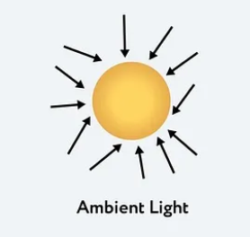
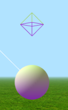
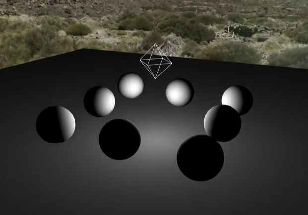

# threejs의 Light와 Shadow

## Light

Light들 구현을 위한 추상 기본 클래스.<br/>
조명(Light)은 장면에 조명을 추가하여 그림자, 반사, 그리고 장면의 렌더링을 조절하는 요소이다.<br/>
three.js는 여러 가지 종류의 light를 지원한다.

## AmbientLight

<p align="center">
  
</p>

> [그림 출처- Enlightening 3D Worlds: Mastering Lighting Techniques in Three.js](https://medium.com/@althafkhanbecse/title-enlightening-3d-worlds-mastering-lighting-techniques-in-three-js-c860caa8cdcf) > <br/>

`AmbientLight`는 Scene의 모든 객체를 전체적으로 동등하게 비춘다.<br/>
주로 Scene이 완전한 검은색으로 되는 것을 방지하고, 전반적인 휘도를 설정하는데 사용된다.<br/>
방향이 없는 조명이기에 그림자를 투사할 수 없다.<br/>

```js
const light = new THREE.AmbientLight(0x404040); // 흰색 조명
scene.add(light);
```

첫번째 인자로는 RGB의 값을 전달해 `색상`을 설정한다.<br/>
두번째 인자는 `intensity`, `조명의 강도값`을 설정하며 기본값은 1이다.<br/>

## DirectionalLight

<p align="center">
  
</p>

> [그림 출처- Three.js How To Tutorial](https://danni-three.blogspot.com/2013/09/threejs-shadows.html)

특정한 방향으로 비춰지는 평행한 광선의 집합인 조명이다.<br/>
흔히 태양빛을 구현하는데 사용되는데, 태양은 매우 먼 위치에 존재해 있기에 우리가 받는 그 빛은 모두 평행하게 보인다는 특징을 가진다.<br/>
이 조명은 그림자를 투사할 수 있다.<br/>

```js
const directionalLight = new THREE.DirectionalLight(0xffffff, 0.5);
scene.add(directionalLight);
```

파라미터로 전달되는 요소들은 `AmbientLight`와 동일하다.

### properties

### .CastShadow : boolean

true로 설정하면 동적인 그림자를 캐스팅할 수 있다.<br/> 비싸고 그림자가 제대로 보이도록 조정해야한다. 기본값은 false이다.

### .isDirectionalLight : boolean

DirectionalLight 타입인지 체크하는 플래그

### .position : Vector3

조명의 위치를 3차원 벡터값으로 설정한다.

### .target : Object3D

해당 `DirectionalLight`가 향하고 있는 방향을 정의한다.<br/>
일반적으로 특정 객체를 가리키는데 사용하며 그림자의 방향을 제어하는데 영향을 끼친다.<br/>

```js
const targetObject = new THREE.Object3D();
scene.add(targetObject);
light.target = targetObject;
```

이 속성값으로 그림자의 모양과 방향, 크기가 달라진다.<br/>
기본 위치는 (0, 0, 0)이며 기본값을 변경하려면 `Scene`에 추가해야한다.

```js
scene.add(light.target);
```

<br/>

## HemisphereLight

<p align="center">
  
</p>

> [그림 출처- Three.js - HemisphereLight 光源](https://blog.csdn.net/ithanmang/article/details/81331174)

`하늘에서 오는 광선`과 `지표면에서 반사되는 광선`을 모두 시뮬레이션하여 Scene을 비추는 데 사용되는 조명이다.<br/>

```js
const light = new THREE.HemisphereLight(0xffffbb, 0x080820, 1);
scene.add(light);
```

전달되는 인자는 색상 헥스 코드인데, 각각 `하늘 조명`과 `지표면 조명`이다. <br/>기본값은 oxffffff으로 백색이며, 세번째 인자는 `빛의 강도`이다.

## LigthProbe

LightProbe는 3D Scene에 조명을 추가하는 또다른 방법이다.<br/>
다른 광원 객체와 달리, light probe는 빛을 방출하지 않는다.<br/>
대신 `3D 공간에서 지나가는 빛에 관한 정보`를 저장한다.<br/>
렌더링 과정 중에, 3D 개체와 충돌하는 빛은 이 light probe의 데이터를 통해 계산된다.<br/>
이를 통해 실제 조명에 대응하는 증강 현실 컨텐츠를 제작할 수 있다.<br/>

## Point Light

한 지점에서 모든 방향으로 방출되는 빛이다.<br/>
`DirectionalLight`와 비슷하지만, `Point Light`가 사용자가 직접 방향을 계산하고 적용할 수 있다는 점에서 차이를 가진다.
전구의 빛 방출을 모방할 때 주로 사용한다.<br/>

```js
const light = new THREE.PointLight(0xff0000, 1, 100);
light.position.set(50, 50, 50);
scene.add(light);
```

생성자에 다음 항목들을 인수로 전달한다.<br/>
`color` - 조명의 색상을 헥스코드로 전달한다.<br/>
`intensity` - 조명 강도를 숫자로 전달하며 기본값은 1이다.<br/>
`distance` - 빛의 최대 범위를 나타내며 기본값은 0이다.<br/>
`decay` - 빛의 거리에 따라 빛이 어두워지는 양이며 기본값은 2이다.<br/>

<p align="center">
  
</p>

> [이미지 출처 - Three.js Lighting Tutorial (JavaScript) | Light Types Explained! - SimonDev](https://www.youtube.com/watch?v=T6PhV4Hz0u4)

## RectAreaLight

`RectAreaLight`는 직사각형 평면 전체에 균일하게 빛을 내리쬔다.<br/>
Scene을 채우는데 사용할 수 있는 부드러운 직사각형 조명 형태이다.<br/>
이 조명은 밝은 창이나 tv에서 방출되는 조명과 같은 연출을 구현하는데 사용한다.<br/>

<p align="center">
  
</p>

> [이미지 출처 - VIBLO - Light trong Three.js](https://viblo.asia/p/light-trong-threejs-jvElaRLm5kw)

```js
const width = 10;
const height = 10;
const intensity = 1;
const rectLight = new THREE.RectAreaLight(0xffffff, intensity, width, height);
rectLight.position.set(5, 5, 0);
rectLight.lookAt(0, 0, 0);
scene.add(rectLight);

const rectLightHelper = new RectAreaLightHelper(rectLight);
rectLight.add(rectLightHelper);
```

여느 조명과 같이 색상과 강도로 조명을 인스턴스화해준다. 여기에 너비와 높이도 제공해야한다.

## SpotLight

<p align="center">
  
</p>

> [이미지 출처 - VIBLO - Light trong Three.js](https://viblo.asia/p/light-trong-threejs-jvElaRLm5kw)

`SpotLight`은 손전등과 같이 빛에서 멀어질수록 크기가 커지는 원뿔 형태의 조명이다.<br/>
`PointLight`와 유사하지만 `SpotLight`로부터의 거리. 점과 빛 사이의 각도, 빛 방향에 따라 밝기가 줄어들거나 하는 차이점이 있다.<br />

```js
const spotLight = new THREE.SpotLight(
  color, // 색상
  intensity, // 강도
  distance, // 거리
  angle, // 원뿔의 조명각(작을수록 비추는 범위가 좁아짐)
  penumbra, // 부드러운 그림자 페이드 아웃 정도(값이 클수록 그림자가 부드러워짐)
  decay, // 조명이 떨어지는 속도
  position, // 위치
  target // 대상 정의
);
```

SpotLight에 매개변수로 전달되는 값들을 코드에 포함했다.<br />
